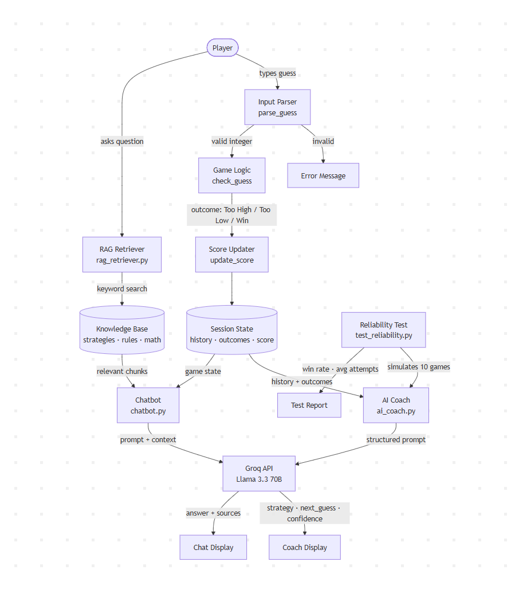

# Game Glitch Investigator — Applied AI System

## Original Project

This project is an extension of **Game Glitch Investigator** from Module 1 of AI110. The original project was a Streamlit number guessing game that had three intentional bugs: reversed Higher/Lower hints, a secret number that changed on every button click, and a broken New Game button. The goal was to find, fix, and test each bug, then refactor all game logic into a separate `logic_utils.py` module with a full pytest suite.

This final version keeps the fully debugged game intact and adds three AI-powered layers on top: an AI Coach, a RAG-powered chatbot, and an automated reliability testing system.

---

## What This System Does

The Game Glitch Investigator AI System is an interactive number guessing game extended with:

- **AI Coach** — analyzes your guess history and outcomes, identifies your strategy, and suggests the optimal next guess with a confidence score
- **RAG Chatbot** — a game assistant that retrieves relevant strategy, rules, and math knowledge before answering your questions
- **Reliability Test** — an automated script that simulates 10 full games using the AI Coach and measures win rate and average attempts

---

## Architecture Overview



The system has four main layers:

1. **Game Logic Layer** (`logic_utils.py`) — parses input, checks guesses, updates score. Stateless and fully unit-tested.
2. **AI Coach Layer** (`ai_coach.py`) — sends guess history with outcomes to the Groq API (Llama 3.3 70B). The model identifies the player's strategy and recommends the next guess using binary search reasoning.
3. **RAG Chatbot Layer** (`rag_retriever.py` + `chatbot.py`) — when the player asks a question, the retriever searches the `knowledge_base/` folder using keyword overlap scoring and passes the most relevant chunks as context to the same Groq model.
4. **Reliability Layer** (`tests/test_reliability.py`) — simulates 10 automated games, feeds AI Coach suggestions back as actual guesses, and reports win rate and average attempts.

---

## Setup Instructions

### 1. Clone the repository

```bash
git clone https://github.com/ataizh/applied-ai-system-final.git
cd applied-ai-system-final
```

### 2. Install dependencies

```bash
pip install -r requirements.txt
```

### 3. Set up your API key

Create a `.env` file in the project root:

```
GROQ_API_KEY=your_groq_api_key_here
```

Get a free API key at [console.groq.com](https://console.groq.com).

### 4. Run the app

```bash
python -m streamlit run app.py
```

### 5. Run the tests

```bash
# Unit tests
pytest tests/test_game_logic.py -v

# Reliability test (makes live API calls)
python tests/test_reliability.py
```

---

## Sample Interactions

### 1. AI Coach with no guesses yet

**Action:** Click "Ask AI Coach" before making any guess.

**Output:**
```
AI Coach | Strategy: No guesses yet | Suggested guess: 50 | Confidence: 100%
Starting with the middle number allows for the most efficient elimination of possibilities.
```

### 2. AI Coach mid-game after two guesses

**Guesses:** 50 (Too High), 25 (Too Low)

**Output:**
```
AI Coach | Strategy: Binary Search | Suggested guess: 37 | Confidence: 95%
The number is between 26 and 49. The midpoint 37 eliminates the most possibilities.
```

### 3. RAG Chatbot — strategy question

**Player:** "what is binary search?"

**Assistant:** "Binary search is the optimal strategy for this game. Always guess the midpoint of the remaining range — for 1-100 start with 50, then narrow by half each time. This guarantees finding the answer in at most 7 guesses.

*Sources: strategies, math_tips*"

### 4. RAG Chatbot — rules question

**Player:** "how does scoring work?"

**Assistant:** "Winning scores 100 minus 10 times your attempt number, with a minimum of 10 points. So winning on attempt 1 gives 90 points, attempt 5 gives 50 points. Wrong guesses that are too high on even attempts gain 5 points, while too-low guesses lose 5 points.

*Sources: game_rules*"

---

## Design Decisions

**Why Groq instead of other APIs?**
The Gemini API free tier is unavailable in some regions (quota limit of 0). Groq offers a generous free tier with no regional restrictions and runs significantly faster due to its custom LPU hardware. Llama 3.3 70B performs on par with GPT-3.5 for structured reasoning tasks like this one.

**Why pass outcomes alongside guesses to the coach?**
In early testing the coach only received guess numbers without outcomes. This caused it to loop between the same numbers with a 10% win rate. Passing `"50 -> Too High, 25 -> Too Low"` instead of just `"50, 25"` gave the model the context it needs for binary search reasoning, raising the win rate to 90%.

**Why keyword overlap for RAG instead of embeddings?**
The knowledge base is small (3 files, ~15 paragraphs). A full vector database and embedding model would add significant overhead for marginal gain. Word overlap scoring is transparent, requires no additional dependencies, and is fast enough for real-time use. For a larger knowledge base, switching to sentence-transformers would be the natural next step.

**Why separate `ai_coach.py` and `chatbot.py`?**
The coach produces a structured response (strategy, number, confidence) for a specific game action. The chatbot maintains conversation history and answers open-ended questions. Separating them keeps each module focused and independently testable.

---

## Testing Summary

### Unit Tests (`tests/test_game_logic.py`)

11 tests covering core game logic — all pass:

- Winning, too high, and too low outcomes return correct values
- Hint messages say the right direction after the bug fix
- Same guess always returns the same result (no type-flip)
- Decimal input is truncated, negative numbers handled, whitespace rejected

### Reliability Test (`tests/test_reliability.py`)

10 automated games on Normal difficulty (range 1-100, 8 attempt limit):

| Metric | Result |
|---|---|
| Win rate | 9/10 (90%) |
| Average attempts (wins only) | 5.0 |
| Optimal binary search max | 7 |
| Games lost | 1 |

**What worked:** Once given guess outcomes, the AI Coach reliably applied binary search — starting at 50, then narrowing by half each round. It won games in as few as 2 attempts.

**What didn't:** One game was lost because the coach shifted to sequential guessing near the end of the range instead of bisecting. This reveals a limitation: the model occasionally drifts from pure binary search when the remaining range is small and the history is long.

**What I learned:** Passing outcomes with guesses was the critical fix. Without them, win rate was 10%. With them, it jumped to 90%. Context quality matters more than model capability for structured reasoning tasks.

---

## Reflection and Ethics

**Limitations and biases:**
The system relies on the Groq API being available. If the API is down or rate-limited, the game still works but AI features degrade gracefully to a warning message. The RAG retriever uses keyword overlap which can miss semantically related content — asking "how do I win faster?" retrieves less relevant results than asking "what is binary search strategy."

**Potential misuse:**
The AI Coach essentially solves the game for you, removing the challenge if used every turn. In a real product the coach would be limited to one use per game or give directional hints rather than exact guesses.

**Surprises during testing:**
The biggest surprise was how dramatically prompt format affected reliability — going from 10% to 90% win rate simply by changing `"50, 25"` to `"50 -> Too High, 25 -> Too Low"`. The model is capable of binary search reasoning but only when the prompt makes the outcome structure explicit.

**AI collaboration:**
Claude Code was used throughout this project to help write and debug code. One helpful suggestion was structuring the RAG retriever as a separate module (`rag_retriever.py`) rather than embedding retrieval logic inside the chatbot — this made it independently testable and reusable. One flawed suggestion was the initial coach prompt that only passed guess numbers without outcomes, which caused the 10% win rate failure. Diagnosing and fixing that required understanding why the model was looping and redesigning the prompt structure manually.
