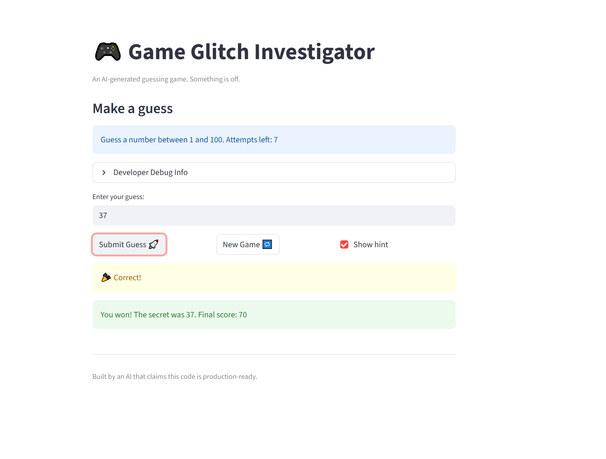
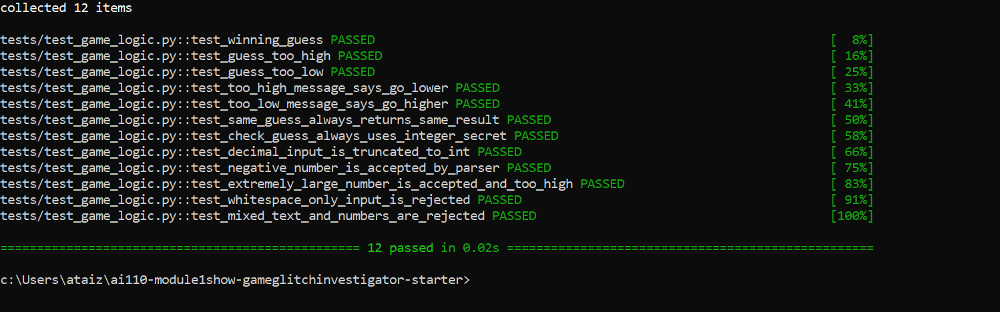

# 🎮 Game Glitch Investigator: The Impossible Guesser

## 🚨 The Situation

You asked an AI to build a simple "Number Guessing Game" using Streamlit.
It wrote the code, ran away, and now the game is unplayable. 

- You can't win.
- The hints lie to you.
- The secret number seems to have commitment issues.

## 🛠️ Setup

1. Install dependencies: `pip install -r requirements.txt`
2. Run the broken app: `python -m streamlit run app.py`

## 🕵️‍♂️ Your Mission

1. **Play the game.** Open the "Developer Debug Info" tab in the app to see the secret number. Try to win.
2. **Find the State Bug.** Why does the secret number change every time you click "Submit"? Ask ChatGPT: *"How do I keep a variable from resetting in Streamlit when I click a button?"*
3. **Fix the Logic.** The hints ("Higher/Lower") are wrong. Fix them.
4. **Refactor & Test.** - Move the logic into `logic_utils.py`.
   - Run `pytest` in your terminal.
   - Keep fixing until all tests pass!

## 📝 Document Your Experience

**Purpose:** A number guessing game where the player tries to guess a secret number within a limited number of attempts, with hints after each guess.

**Bugs found:**
- Hints were backwards — "Go Higher" when you needed to go lower, and vice versa
- After losing, clicking New Game left the game stuck on the game over screen
- Entering the same number twice gave different hints each time due to a type-flip bug in the original code

**Fixes applied:**
- Corrected the hint messages in `check_guess` inside `logic_utils.py`
- Added `st.session_state.status = "playing"` (plus history and score resets) to the New Game button handler
- Removed the even/odd attempt type-conversion that was converting the secret to a string on every other guess
- Refactored all game logic out of `app.py` into `logic_utils.py`

## 📸 Demo

### Challenge 1: Edge-Case Test Results

## 🚀 Stretch Features

- [ ] [If you choose to complete Challenge 4, insert a screenshot of your Enhanced Game UI here]

